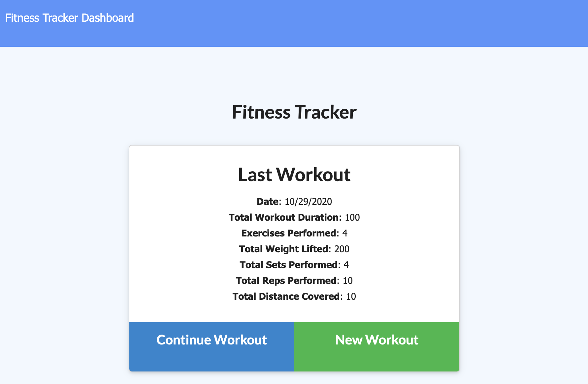
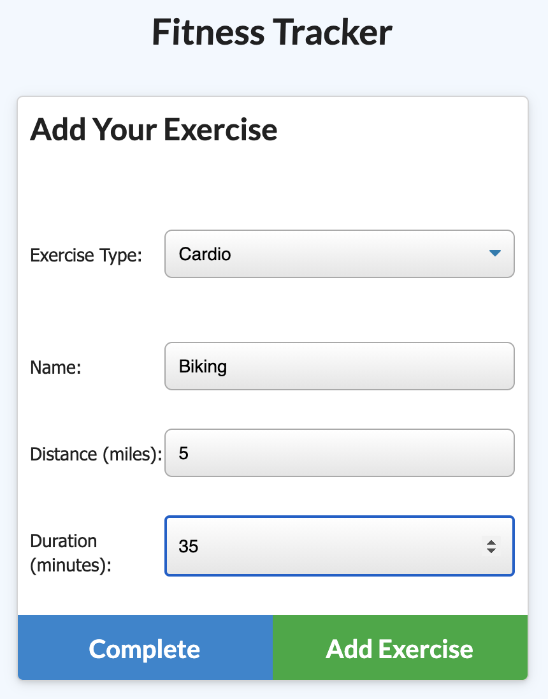
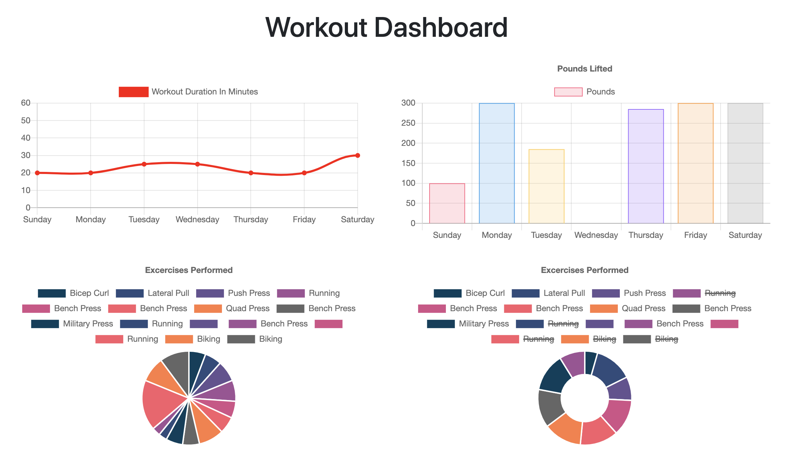

# NoSQL-Workout-Tracker

## Deployed Website:
### [http://track-fitness-2020.herokuapp.com/](http://track-fitness-2020.herokuapp.com/)

## DESCRIPTION
A fitness tracker web application, incorporating a Mongo database. Users can enter individual exercises, which are stored as entries in a larger workout collection. These workouts are compiled and recorded over time, allowing the user to track their progress!

## SCREENSHOTS
### Screenshot of the landing page, showing the user's last workout

### Screenshot of the exercise page, where the user can enter a new exercise

### Screenshot of the graphs page, displaying tracked exercises over time

## TABLE OF CONTENTS
* [Installation](#installation)
* [Usage](#usage)
* [License](#license)
* [Contributing](#contributing)
* [Retrospective](#retrospective)

## INSTALLATION
- No installation is required, as the user can simply visit the deployed application link: [http://track-fitness-2020.herokuapp.com/](http://track-fitness-2020.herokuapp.com/)
- However, if the user wishes to investigate the code locally, the following steps should be performed:
    - Clone the repo for use on your local machine
    - Use the command line to locate the cloned repo and make it your current directory
    - Type `npm install` in the command line
    - This will install the necessary node module packages and dependencies
    - Under the assumption that the user has MongoDB previously installed and/or running, no further installation is required; however, if the user wishes to have "test" data available immediately upon launching the app, please do the following:
        - Type `npm run seed` in the command line
        - `seed` is one of the scrips contained in the package.json file
        - This will run the seeder file located at `seeders/seed.js`
        - The database will now be populated with the "test" data 

## USAGE
- To run the application locally...
    - Use the command line to locate the cloned repo and make it your current directory
    - Simply type `node server.js` in the command line
    - Executed correctly, the command line should respond with `Server listening on http://localhost:####`
    - Open your preferred browswer and visit `http://localhost:####/`
    - In both instances above, replace `####` with the corresponding PORT number as noted in the server.js file
    - To end the server instance, simply type "ctrl" + "c"
- To run the application online, please visit the deployed link: [http://track-fitness-2020.herokuapp.com/](http://track-fitness-2020.herokuapp.com/)
- Application functionality is identical whether you are running the server locally or visiting the deployed link:
    - After arriving at the landing page, users have the ability to do the following:
        - Start a new workout
        - Continue a workout
        - Visit the dashboard (aka, the graphs page, which displays tracked exercises over time)
    - "Start a new workout" and "Continue a workout" are similar in functionality, in that they both take the user to the `/exercise` route. However, they are different in that "Start workout" initializes a new Workout collection, and "Continue a workout" utilizes the most recent Workout collection.
    - While at the `/exercise` route, the user can enter the type of exercise (cardio or resistance) and sub-fields of information (duration, distance, reps, weight, etc.)
    - Once complete, the exercise document is saved to the Workout collection
    - Users may proceed in this fashion – adding exercises and workouts – until they wish to view a summary of their recent efforts: this can be achieved by clicking "Dashboard", which will take the user to the `/stats` route
    - On the `/stats` route, the user can see a summary of their recent workout efforts, tracked by day, exercise type, frequency, etc.

## LICENSE
License: MIT License 
[https://opensource.org/licenses/MIT](https://opensource.org/licenses/MIT)

## CONTRIBUTING
[https://github.com/JPBrickhouse](https://github.com/JPBrickhouse)

## RETROSPECTIVE
This was an informative homework assignment, that afforded many opportunites for learning and growth. While the entirety of the frontend code was provided, the requirements dictated that we create a Mongo database with a Mongoose schema and handle routes with Express. As such, I created the following files:
- `server.js`
- `routes/api-routes.js`
- `routes/html-routes.js`
- `models/index.js`
- `models/Workout.js`
 

With these files created, I "connected the dots," ensuring that the server found the correct routes (both for the html files and the APIs routes), connected the backend to the frontend, and successfully connected to the database model.
